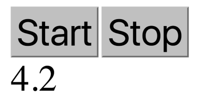

# Introduccion RX Conceptos:

Los observables son como arrays en el sentido de que representan una colección de eventos, pero también
son como promesas en el sentido de que son asíncronos: cada evento en la colección llega en algún punto
indeterminado en el futuro. 

un observable puede manejar un número arbitrario de eventos, y una promesa solo puede rastrear una cosa


 (¡imagina diseñar una aplicación web que
espera que todos los clics ocurran a la vez!). Al igual que con una promesa, necesitamos desempaquetar
nuestro observable para acceder a los valores que contiene. El método de desempaquetado de un
observable se llama subscribe.

La función pasada a subscribe se llama cada vez que el observable emite un valor. (En este caso, se registra
un mensaje en la consola cada vez que se hace clic en el botón.)

```js
let myObs$ = clicksOnButton(myButton);

myObs$.subscribe(clickEvent => console.log('¡Se hizo clic en el botón!'));
```

Una cosa a tener en cuenta aquí es que los observables en RxJS son perezosos. Esto significa que si no hay
una llamada a subscribe en myObs$, no se crea un controlador de eventos de clic. Los observables solo
se ejecutan cuando saben que alguien está escuchando los datos que están emitiendo


# Construyendo un cronómetro:
Basta de teoría: probablemente tengas ganas de empezar a construir algo. La primera
El proyecto que emprenderás en este libro es un cronómetro que contiene tres observables. El cronómetro contará con dos botones, uno de arranque y otro de parada, con un seguimiento observable en cada uno. Detrás de escena habrá un tercero.
observable, contando los segundos desde que se presionó el botón de inicio en
incrementos de 1/10 de segundo. Este observable estará conectado a un
contador en la página. Aprenderá cómo crear observables que reciban información.
del usuario, así como observables que interactúan con el DOM para mostrar
el último estado de su aplicación.


 > 

 Antes de pasar al código, tómate un segundo para pensar en cómo implementarías
esto sin receta. Habría un par de controladores de clic para iniciar y detener
botones. En algún momento, el programa crearía un intervalo para contar los
segundos. Esboce la estructura del programa: ¿en qué orden se desarrollan estos eventos?
sucede en? ¿Recordó borrar el intervalo después de presionar el botón de parada?
¿presionado? ¿Está la lógica empresarial claramente separada de la vista? Normalmente, estos
No hay preocupaciones para una aplicación de este tamaño; Los estoy llamando específicamente ahora,
para que puedas ver cómo Rx los maneja en un simple cronómetro. Más adelante, podrás
Utilice las mismas técnicas en proyectos mucho más grandes, sin perder claridad.
Este proyecto tiene dos categorías diferentes de observables. El cronómetro de intervalos
tiene su propio estado interno y salidas al modelo de objetos de documento (DOM).
Las transmisiones de dos clics se adjuntarán a los botones y no tendrán ningún
tipo de estado interno. Abordemos primero la parte más difícil: el cronómetro de intervalos.
detrás de escena que necesita mantener el estado.

# Running a Timer
Este temporizador deberá realizar un seguimiento del número total de segundos transcurridos y emitir
el último valor cada 1/10 de segundo. Cuando se presiona el botón de parada,
el intervalo debe cancelarse. Necesitaremos un observable para esto, que conduzca a
la pregunta: "¿Cómo puedo construir un observable?"
Buena pregunta: lea este ejemplo (no se preocupe por saber
todo lo que está sucediendo, pero haga algunas conjeturas a medida que lo analiza).

```js
import { Observable } from 'rxjs';

let tenthSecond$ = new Observable(observer => {
  let counter = 0;
  observer.next(counter);

  let interv = setInterval(() => {
    counter++;
    observer.next(counter);
  }, 100);

  return function unsubscribe() {
    clearInterval(interv);
  };
});

```

Repasemos eso línea por línea. A medida que lees cada fragmento de
código

```js
import { Observable } from 'rxjs';
```

Lo primero es utilizar la importación para incorporar Observable desde la biblioteca RxJS. Todo
de los proyectos en este libro comienzan incorporando los componentes necesarios para
ejecutar el proyecto. Si su editor admite TypeScript (recomiendo Visual Studio
Código1
), probablemente tengas la opción de importar cosas automáticamente a medida que
tipo. La mayoría de los ejemplos de este libro omiten la declaración de importación en aras de la brevedad.

```js
let tenthSecond$ = new Observable(observer => {
```

Ahí está nuevamente el signo del dólar, que indica que la variable contiene un observable.
Al otro lado del signo igual está el constructor Rx estándar para
observables, que toma un solo argumento: una función con un solo parámetro, un observador. Técnicamente, un observador es cualquier objeto que tiene las siguientes
métodos: `next(someItem)` (llamado para pasar el último valor a la secuencia observable),
`error(someError)` (llamado cuando algo sale mal) y `complete()` (llamado una vez
la fuente de datos no tiene más información que transmitir). En el caso del
función constructora observable, Rx crea el observador por usted y pasa
a la función interna. Más adelante veremos otros lugares que puedes utilizar.
observadores e incluso crear otros nuevos.

```js
let counter = 0;
observer.next(counter);
let interv = setInterval(() => {
    counter++;
    observer.next(counter);
}, 100);
```

Dentro de la función constructora, las cosas se ponen interesantes. Hay un estado interno
en la variable `counter` que rastrea el número de décimas de segundo desde
el comienzo. Inmediatamente, se llama a `observer.next` con el valor inicial de 0. Luego
hay un intervalo que se dispara cada 100ms, incrementando el contador y
llamando a `observer.next(counter)`. Este próximo método sobre el observador es cómo un
observable anuncia al suscriptor que tiene un nuevo valor disponible para
consumo. El resultado práctico es que este observable emite un número entero.
cada 100 ms representa cuántos decisegundos han transcurrido desde...

…bueno, ¿cuándo exactamente se ejecuta esta función? Lanza algunas declaraciones de console.log
y ejecute el fragmento anterior. ¿Lo que sucede?

No aparece nada en la consola; parece que el constructor nunca se ejecuta realmente. Este es el observable perezoso en acción. En el mundo de Rx, esta función constructora solo se ejecutará cuando alguien se suscriba a ella. No solo eso, sino que si hay un segundo suscriptor, todo esto se ejecutará por segunda vez, creando una transmisión completamente separada (¡esto significa que cada suscriptor tiene su propio temporizador)! Puedes aprender más sobre cómo funciona todo esto en `Multiplexing Observables`, pero por ahora, solo recuerda que cada suscripción crea una nueva transmisión. Finalmente, la función interna devuelve `yet another function` `(llamada función de cancelar suscripción)`:

```js
return function unsubscribe() { clearInterval(interv); };
```

Si la función del constructor devuelve otra función, esta función interna se ejecuta cada vez que un listener se desuscribe del observable fuente. En este caso, el intervalo ya no es necesario, así que lo eliminamos. Esto ahorra ciclos de CPU, evitando que los ventiladores se activen en las computadoras de escritorio, y los usuarios de dispositivos móviles nos lo agradecerán al ahorrar sus baterías. Recuerda, cada suscriptor obtiene su propia instancia del constructor y, por lo tanto, tiene su propia función de limpieza. Toda la lógica de configuración y desconfiguración se encuentra en el mismo lugar, por lo que requiere menos carga mental recordar limpiar todos los objetos que se crean.

Hablando de carga mental, esa fue mucha información en solo unas pocas líneas de código. Hay muchos conceptos nuevos aquí, y podría volverse tedioso escribir esto cada vez que queremos un intervalo. Afortunadamente, todo este trabajo ya ha sido implementado en la biblioteca Rx en forma de un operador de creación:

```js
import { interval } from 'rxjs';

let tenthSecond$ = interval(100);
```

Rx viene con un montón de estos operadores de creación para tareas comunes. Puedes encontrar la lista completa bajo el encabezado "Static Method Summary" en el sitio oficial de RxJS. `interval(100)` es similar a la gran función del constructor que teníamos anteriormente. Ahora, para ejecutar realmente este código, suscríbete:

```js
tenthSecond$.subscribe(console.log);
```

Cuando hay una llamada a `subscribe`, los números comienzan a registrarse en la consola. Sin embargo, los números que se registran están ligeramente desfasados de lo que queremos. La implementación actual cuenta el número de décimas de segundo desde la suscripción, no el número de segundos. Una forma de solucionarlo es modificar la función del constructor, pero meter toda la lógica en la función del constructor se vuelve incómodo. En su lugar, un flujo observable modifica los datos después de que un observable raíz los emite mediante una herramienta llamada operador.


# Piping Data Through Operators
Un operador es una herramienta proporcionada por RxJS que te permite manipular los datos en el observable a medida que fluyen. Puedes importar operadores desde 'rxjs/operators'. Para usar un operador, pásalo al método .pipe de un observable. Aquí, el ficticio exampleOperator se utiliza con fines ilustrativos:

```js
import { interval } from 'rxjs';
import { exampleOperator } from 'rxjs/operators';

interval(100).pipe(exampleOperator());
```

# Manipulating Data in Flight with map

Ahora mismo, tienes una colección de datos casi correctos que solo necesita un pequeño ajuste para ser correcta. Aquí es donde entra en juego el operador map.
Hablando en general, una función map toma dos parámetros (una colección y otra función), aplica la función a cada elemento y devuelve una nueva colección que contiene los resultados. Una implementación sencilla se ve algo así:

```js
function map(oldArr, someFunc) {
  let newArr = [];
  for (let i = 0; i < oldArr.length; i++) {
    newArr.push(someFunc(oldArr[i]));
  }
  return newArr;
}
```

JavaScript proporciona un método `map` incorporado para arrays que solo toma un parámetro (la función). El array en cuestión es aquel sobre el cual se llama el método `map`.

```js
let newArr = oldArr.map(someFunc);
```

Este ejemplo solo funciona con arrays síncronos; conceptualmente, map funciona con cualquier tipo de colección. Los observables son precisamente una colección, y Rx proporciona su propio operador map. Se canaliza a través de un observable fuente, toma una función y devuelve un nuevo observable que emite el resultado de la función proporcionada. Es importante destacar que la modificación en map es síncrona. Aunque lleguen nuevos datos con el tiempo, este map modifica inmediatamente los datos y los pasa. En cuanto a la sintaxis, la única diferencia importante es que el ejemplo de RxJS utiliza pipe para aplicar map:

```JavaScript
let newObservable$ = oldObservable$.pipe(
    map(someFunc)
);
```

Podemos aplicar este concepto de mapeo a tenthSecond$. El observable fuente será el intervalo creado anteriormente. La modificación consiste en dividir el número entrante por 10. El resultado se verá algo así:

```js
tenthSecond$.pipe(map((num) => num / 10)).subscribe(console.log);
```

Con estas pocas líneas, el primer observable está listo. Quedan dos más por hacer.


# Handling User Input
El siguiente paso es gestionar los clics en los botones de inicio y detención. Primero, obtén los elementos de la página con querySelector:

```js
let startButton = document.querySelector('#start-button');
let stopButton = document.querySelector('#stop-button');
```

Ahora que tenemos los botones, necesitamos descubrir cuándo el usuario hace clic en ellos. Podrías usar el constructor que se cubrió en la última sección para construir un observable que transmita eventos de clic desde un elemento arbitrario:

```js
function trackClickEvents(element) {
  return new Observable(observer => {
    let emitClickEvent = event => observer.next(event);
    element.addEventListener('click', emitClickEvent);
    return () => element.removeEventListener('click', emitClickEvent);
  });
}
```

Similar a interval, podemos dejar que la biblioteca haga todo el trabajo por nosotros. Rx proporciona un operador de creación llamado fromEvent para exactamente este caso. Toma un elemento DOM (u otro objeto que emita eventos) y un nombre de evento como parámetros, y devuelve un flujo que se dispara cada vez que el evento ocurre en el elemento. Utilizando los botones de arriba:

```js
import { fromEvent } from 'rxjs';

let startButton = document.querySelector('#start-button');
let stopButton = document.querySelector('#stop-button');

let startClick$ = fromEvent(startButton, 'click');
let stopClick$ = fromEvent(stopButton, 'click');
```

Añade un par de subscripciones al ejemplo anterior para asegurarte de que todo esté funcionando. Cada vez que hagas clic, deberías ver un objeto de evento de clic registrado en la consola. Si no lo ves, asegúrate de que el código se suscribe al observable correcto y de que estás haciendo clic en el botón correcto.